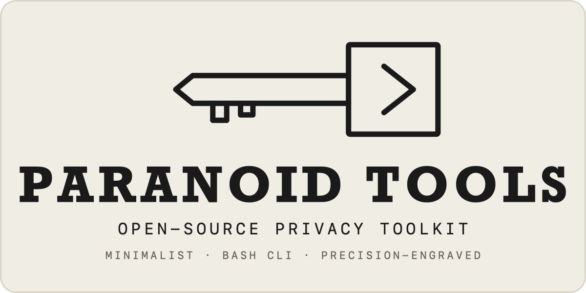
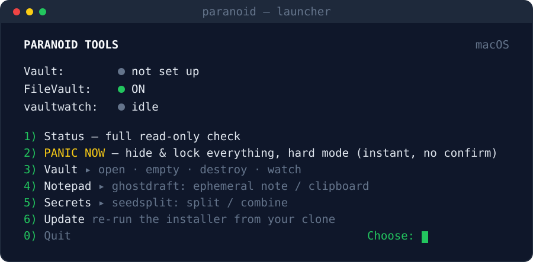

<div align="center">

**English** · [Русский](README.ru.md)



### Honest privacy &amp; security tools for macOS &amp; Windows — one job each, no snake oil.

[](LICENSE)
&nbsp;
&nbsp;
&nbsp;
&nbsp;

**[Guide](GUIDE.md)** &nbsp;·&nbsp; **[Manifesto](MANIFEST.md)** &nbsp;·&nbsp; **[Threat model](THREAT-MODEL.md)** &nbsp;·&nbsp; **[Tools](#the-tools)** &nbsp;·&nbsp; **[Install](#install)** &nbsp;·&nbsp; **[Launcher](#the-launcher)**



</div>

> **Don't trust, verify.** Ed25519-signed releases · zero runtime dependencies (two
> opt-in exceptions, named in the install notes) · one auditable file per tool · shellcheck-clean. Every limitation is stated plainly — see each
> tool's *Scope &amp; limitations*. No third-party audit is claimed — but the whole thing is
> ~3,900 lines of shell across six scripts, so reading it yourself is an evening, not a project.

**Not a password manager.** A small, auditable, local toolkit for the few secrets whose
leak you can't undo — no cloud, no telemetry, no promises it can't keep. It closes the
gap between your password manager, disk encryption, and a paper backup. Whether it fits
your case — and what it will *not* protect you from — is spelled out in the
**[threat model](THREAT-MODEL.md)**.

An umbrella of small command-line tools around the **lifecycle of a secret**
(seed phrase / password / key). Each tool is its own git repo — a single-file
script (pure Bash on macOS, a PowerShell port on Windows) with **zero
runtime dependencies** — and is honest about the limits of what it can guarantee.

## The tools

| # | Tool | Step in a secret's life | Platform | Latest |
|---|------|-------------------------|----------|--------|
| 1 | [`securetrash`](https://github.com/Di-kairos/securetrash) | store in an encrypted vault, empty or destroy it | macOS · Windows (beta) | [](https://github.com/Di-kairos/securetrash/releases/latest) |
| 2 | [`vaultwatch`](https://github.com/Di-kairos/vaultwatch)   | guard a vault while it's open — **early, work in progress** | macOS · Windows (beta) | [](https://github.com/Di-kairos/vaultwatch/releases/latest) |
| 3 | [`panic`](https://github.com/Di-kairos/panic)             | close vaults, detach volumes, clear the clipboard, lock the screen — instantly | macOS · Windows (beta) | [](https://github.com/Di-kairos/panic/releases/latest) |
| 4 | [`ghostdraft`](https://github.com/Di-kairos/ghostdraft)   | write/view text without leaving copies in the usual places — **early** | macOS · Windows (beta) | [](https://github.com/Di-kairos/ghostdraft/releases/latest) |
| 5 | [`seedsplit`](https://github.com/Di-kairos/seedsplit)     | split a secret into Shamir shares (+ passphrase on macOS) | macOS · Windows (beta) | [](https://github.com/Di-kairos/seedsplit/releases/latest) |

> **Windows.** All five tools ship PowerShell ports (beta, Pester-tested in CI; seedsplit
> shares are byte-compatible with the macOS build). The macOS primitives — Spotlight, Time
> Machine, `launchd`, `hdiutil` — are mapped to their Windows equivalents (Windows Search,
> VSS, Task Scheduler, BitLocker), with the gaps reported honestly per tool.

Each tool ships an English `README.md` (Russian in `README.ru.md`), a
`CHANGELOG.md`, a checksum-verified and **Ed25519-signed** `install.sh`, CI +
release workflows, and a dedicated **Scope & limitations** section — read it
before you trust the tool. Everything a user reads to operate the tools — READMEs,
`GUIDE.md`, the CLI output itself — exists in both languages. The changelogs and
`docs/RELEASE-STATE.md` are release notes written in Russian; what they describe is
in the English docs, and `git log` is English throughout.

## Install

One command installs all five tools plus the launcher into `~/.local/bin`:

```bash
git clone https://github.com/Di-kairos/paranoid-tools
cd paranoid-tools
bash install.sh            # installs all 5 + the paranoid launcher
```

On a fresh clone each tool is pulled from its own **signed release** with verify-then-run:
the installer checks the Ed25519 signature over `SHA256SUMS`, then the checksum of the
tool's own `install.sh`, and only then runs it — which in turn verifies the binary before
installing. So every artifact pulled from the network — a tool's own `install.sh` and its
binary — is verified before it runs (you launch the top-level `bash install.sh` yourself,
after reading it). Pin a version with `PT_ST_VERSION` / `PT_VW_VERSION` / `PT_PANIC_VERSION` /
`PT_GHOSTDRAFT_VERSION` / `PT_SEEDSPLIT_VERSION` (any other spelling is ignored silently);
change the target dir
with `PT_DEST=/usr/local/bin`.

Honest switches and edges, named before you find them: `ALLOW_UNSIGNED_LEGACY=1`
deliberately downgrades verification to hash-only — it exists for pre-signing releases;
`PT_ALLOW_PARTIAL=1` lets a run finish when some tools failed to install. On a maintainer
layout (tool directories present in the clone) `install.sh` copies those working-copy
files instead of downloading signed releases — and says so in its output. The Windows
installers carry the same idea under a different name: `PT_ALLOW_HASH_ONLY=1`. The
zero-dependency claim has two opt-in exceptions: `panic hotkey` needs `skhd`,
`seedsplit -p` needs `openssl` (both stated in the tool READMEs) — and on Windows the
port itself runs on PowerShell 7, the one platform prerequisite.

**Linux.** `install.sh` refuses to run there, and that is deliberate rather than an oversight:
securetrash, vaultwatch, panic and ghostdraft are built on macOS primitives (`hdiutil`,
`fdesetup`, `mdutil`, `tmutil`, `launchd`) with no Linux equivalents that would keep the same
honesty about what is guaranteed. A LUKS/systemd port would be a different tool, not a flag.
`seedsplit` is the exception — pure arithmetic over POSIX utilities; clone it and run it.

Prefer to install just one tool, or inspect each step by hand? Every tool's README carries a
standalone verify-then-run snippet plus a one-line quick form. Note those per-tool installers
default to `/usr/local/bin` (and ask for sudo), while this one installs into `~/.local/bin` — if
you use both, you end up with two copies and `PATH` decides which one runs. Set `PT_DEST` or the
tool's own destination variable to keep them in one place. See [the tools](#the-tools).

**Verify the releases yourself.** `bash verify-releases.sh` downloads the published release of
every tool and checks each Ed25519 signature and checksum against the key pinned in this repo —
it installs nothing and needs nothing but `curl` and `ssh-keygen`. That is the "don't trust,
verify" claim in the badge, executable. More on what is tested and how: [docs/TESTING.md](docs/TESTING.md).

**Homebrew** covers `securetrash` today (`brew install Di-kairos/tap/securetrash`); the other
four carry a formula in their repo but are not published in the tap yet — install those with
the commands above.

### Uninstall

```bash
bash install.sh --uninstall   # remove all tools and the launcher
```

### Windows

The one-line `install.sh` above is macOS only. On Windows it's a few short steps — here's
the whole thing from scratch. Steps **1–2 you do once**; step 3 you repeat per tool.

**1. Install PowerShell 7.** The supported path for install and run is PowerShell 7 (`pwsh`);
the built-in Windows PowerShell 5.1 is not officially supported. In any terminal (press `Win`,
type "PowerShell", Enter):

```powershell
winget install --id Microsoft.PowerShell -e
```

Close that window, then open **"PowerShell 7"** from the Start menu. Confirm the version:

```powershell
pwsh --version      # should print "PowerShell 7.x"
```

**2. Install Git** (used to download a tool), then open a fresh PowerShell 7 window:

```powershell
winget install --id Git.Git -e
```

**3. Install a tool.** Each tool is its own repo — install the ones you want. Example for
`securetrash` (swap the name for `vaultwatch`, `panic`, `ghostdraft`, or `seedsplit`):

```powershell
git clone https://github.com/Di-kairos/securetrash
cd securetrash
pwsh -File windows/install.ps1
```

`install.ps1` downloads the signed release, **verifies its Ed25519 signature and checksum before
installing anything** (and refuses to install if either fails), copies the tool into
`%LOCALAPPDATA%\Programs\securetrash`, and adds it to your PATH automatically.

**4. Use it.** Open a **new** PowerShell window (so the PATH change takes effect), then call the
tool by name:

```powershell
securetrash version
securetrash --help
```

Repeat step 3 for each tool. The `paranoid` menu-launcher also has a Windows version: clone this
repo (`git clone https://github.com/Di-kairos/paranoid-tools`) and run
`pwsh -File windows/paranoid.ps1`.

> **Beta.** The Windows ports are logic-tested in CI but not yet broadly validated on real
> hardware — try them on non-critical data first before trusting them with real secrets.

### Release signing — honest scope

**In short:** the signature protects the delivery channel, but one key covering all five repos
is a shared point of risk.

Releases are signed with a **single Ed25519 key** shared across all five tool repos. Be aware
of the trade-off: compromise of that key (its GitHub Actions secret, or a malicious change to
any repo's `release.yml`) would let an attacker sign a forged release for the **whole
ecosystem**, and the public key is pinned in the installers so there is no in-band revocation
today. The signature still defeats an attacker who only controls the download path (mirror,
CDN, MITM) — which is the common case. Hardening this to **per-repo keys / OIDC-based signing
with a documented rotation & revocation path** is tracked work, not yet shipped. If you need
maximum assurance, pin an exact version and check its `SHA256SUMS` against an independent copy.

### Updating

There is no `update` command — updating means **re-running the installer**. It pulls each
tool's latest signed release and overwrites the binary in place:

```bash
cd paranoid-tools
git pull            # refresh the clone (launcher + installer)
bash install.sh     # reinstall all tools at their latest signed releases
```

Check a tool's version with `securetrash version` (or `--version` on any tool). If a tool's
runtime behavior changed in the update (e.g. `securetrash vault` now mounts the volume
visibly in Finder), an already-open session keeps the old code — reopen it: `securetrash
vault close` then `securetrash vault open`.

**Staying notified.** There's no telemetry and nothing phones home, so a new version won't
find you — you check for it. Cheapest and privacy-clean: on GitHub press **Watch ▸ Custom ▸
Releases** on [paranoid-tools](https://github.com/Di-kairos/paranoid-tools) (and on any
single-tool repo you rely on) — GitHub emails you on every release. The **Latest** badges in
the tools table always show the current release; compare them with your local `<tool>
version`. Installed a tool via Homebrew? `brew upgrade` picks up the new formula. The
`paranoid` launcher also shows an opt-in "update available" line on its dashboard — see
[The launcher](#the-launcher).

Usage guides: **[English](GUIDE.md)** · [Русский](ИНСТРУКЦИЯ.md).

## The launcher

`paranoid` is an interactive launcher — a status dashboard plus a menu — over the
five CLIs. Pure Bash, zero dependencies, just like the tools it drives. The menu is
grouped into submenus — **Vault** (open/close · empty · destroy · watch), **Notepad**
(ghostdraft), **Secrets** (seedsplit) — with *Status* and one-key *PANIC* kept at the top.
**Empty** crypto-shreds the vault's contents and hands you a fresh empty one (a real
guarantee, unlike wiping files in place on an SSD).

It holds no secrets and adds no crypto of its own: it runs the tools you installed and shows
their output — *Scope & limitations* and `check` verdicts included — unaltered. To be precise
about what "signed" covers: signatures are verified **at install time**. At runtime the launcher
and the GUI simply call `securetrash`, `panic` and the rest by name, i.e. whatever your `PATH`
resolves them to — they do not re-verify on every launch. Anyone who can write to a directory
earlier in your `PATH` can put something else there, and no tool here would notice. Run it with
no arguments:

```bash
paranoid          # opens the dashboard + menu
```

<div align="center">

</div>

Honest note: the launcher is for convenience, not real-panic-speed. For an instant,
system-wide panic key, use `panic hotkey install` (a global hotkey via skhd — see panic's
README). An open vault is always flagged "at risk".
A Windows PowerShell mirror now ships at `windows/paranoid.ps1` (beta) — run it with
`pwsh -File windows/paranoid.ps1` (or drop it on PATH as `paranoid`); it drives the
same five PowerShell ports.

**Opt-in update check.** Off by default — nothing on the dashboard touches the network unless
you ask. Set `PARANOID_UPDATE_CHECK=1` and the dashboard adds an *"update available"* line when
an installed tool has a newer signed release. It's the only network call the launcher makes: a
single redirect lookup per tool against GitHub's `releases/latest` (no API key, no telemetry),
cached for 24h. Enable it for a session with `PARANOID_UPDATE_CHECK=1 paranoid`, or export it in
your shell rc to keep it on.

## How it fits together

- **Separate repos + vendoring.** The shared code is the canonical
  `securetrash/lib/common.sh`, vendored inline into each tool between
  `# === BEGIN vendored common (pin: <ref>) ===` markers. A sync script + a CI
  drift check keep copies honest. No runtime dependency, no build step.
- **Vault hooks.** `securetrash vault open/close` fire
  `~/.securetrash/hooks/{post-open,post-close}`; `vaultwatch install-hooks` wires the
  guard into the container's lifecycle through them. (`panic` stays hook-free on
  purpose: it must work even when nothing else is set up.)
- **The ecosystem law.** One tool = one job. Every README must carry an honest
  *Scope & limitations* section. Never manufacture a false sense of security.

## Support

Paranoid Tools is free and open-source (MIT). If it saved you from a leak — or you just
want the work to continue — you can support it via **[GitHub Sponsors](https://github.com/sponsors/Di-kairos)**.
No paywalls, no telemetry, no upsell — and that covers the GUI too: the native menu-bar / tray
layer is free and stays free, like everything else here. Sponsorship funds maintenance, nothing
is sold.

## License

[MIT](LICENSE). This repo carries [`SECURITY.md`](SECURITY.md) and
[`CONTRIBUTING.md`](CONTRIBUTING.md) for the launcher, the installer and the GUI; each tool
repo carries its own MIT `LICENSE`, plus `SECURITY.md` (how to report a vulnerability
privately) and `CONTRIBUTING.md`.
