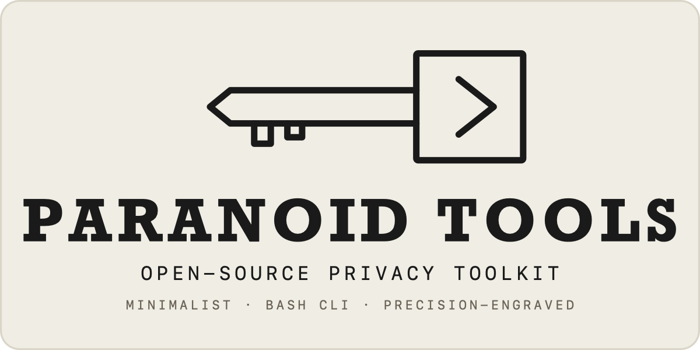
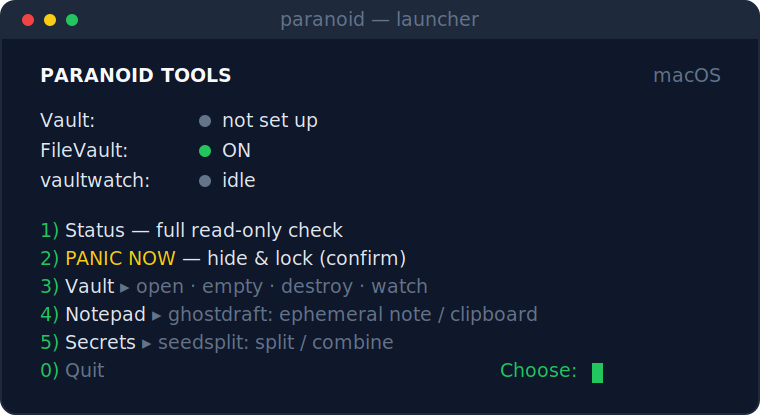

<div align="center">

[English](README.md) · **Русский**



### Честные privacy/security-утилиты для macOS и Windows — каждая делает одно дело, без шарлатанства.

[](LICENSE)
&nbsp;
&nbsp;
&nbsp;
&nbsp;

**[Манифест](MANIFEST.ru.md)** &nbsp;·&nbsp; **[Инструменты](#состав)** &nbsp;·&nbsp; **[Установка](#установка)** &nbsp;·&nbsp; **[Лаунчер](#лаунчер)**



</div>

> **Не доверяй — проверяй.** Релизы подписаны Ed25519 · ноль зависимостей · один читаемый
> файл на инструмент · shellcheck-clean. Каждое ограничение названо прямо — см. *Scope &amp;
> limitations* у каждого инструмента. Сторонний аудит мы не заявляем: код мал настолько,
> что его можно прочитать самому.

Зонтик небольших CLI-инструментов вокруг **жизненного цикла секрета**
(seed-фраза / пароль / ключ). Каждый инструмент — отдельный git-репозиторий,
один файл-скрипт (чистый Bash на macOS/Linux, PowerShell-порт на Windows) с
**нулём зависимостей**, и честно говорит о пределах своих гарантий.

## Состав

| # | Инструмент | Шаг жизни секрета | Платформа | Версия |
|---|------------|-------------------|-----------|--------|
| 1 | [`securetrash`](https://github.com/Di-kairos/securetrash) | хранить в зашифрованном vault, очистить или уничтожить | macOS · Windows (beta) | [](https://github.com/Di-kairos/securetrash/releases/latest) |
| 2 | [`vaultwatch`](https://github.com/Di-kairos/vaultwatch)   | сторожить открытый vault | macOS · Windows (beta) | [](https://github.com/Di-kairos/vaultwatch/releases/latest) |
| 3 | [`panic`](https://github.com/Di-kairos/panic)             | мгновенно спрятать по тревоге | macOS · Windows (beta) | [](https://github.com/Di-kairos/panic/releases/latest) |
| 4 | [`ghostdraft`](https://github.com/Di-kairos/ghostdraft)   | написать или просмотреть без следов на диске | macOS · Windows (beta) | [](https://github.com/Di-kairos/ghostdraft/releases/latest) |
| 5 | [`seedsplit`](https://github.com/Di-kairos/seedsplit)     | разбить секрет на доли (Шамир) + passphrase | macOS · Windows (beta) | [](https://github.com/Di-kairos/seedsplit/releases/latest) |

> **Windows.** У всех пяти инструментов есть PowerShell-порты (beta, покрыты Pester на CI;
> доли seedsplit байт-совместимы с macOS-сборкой). macOS-примитивы — Spotlight, Time Machine,
> `launchd`, `hdiutil` — сопоставлены с Windows-аналогами (Windows Search, VSS, Task Scheduler,
> BitLocker), а где остаются пробелы, об этом честно сказано в каждом инструменте.

У каждого инструмента — английский `README.md` (русский в `README.ru.md`), `CHANGELOG.md`,
установщик `install.sh` с проверкой по контрольной сумме и **подписью Ed25519**, CI и
release-workflow, и обязательный раздел **Scope & limitations** — прочитай его, прежде чем
доверять инструменту.

## Установка

Одна команда ставит все пять инструментов и лаунчер в `~/.local/bin`:

```bash
git clone https://github.com/Di-kairos/paranoid-tools
cd paranoid-tools
bash install.sh            # ставит все 5 + лаунчер paranoid
bash install.sh --uninstall
```

На свежем клоне каждый инструмент тянется из своего **подписанного релиза** по схеме
verify-then-run: установщик проверяет подпись Ed25519 над `SHA256SUMS`, затем контрольную
сумму install.sh самого инструмента и только потом запускает его — а тот, в свою очередь,
проверяет бинарь до установки. Ничего не выполняется, пока не проверено. Закрепить версию —
`PT_PANIC_VERSION=0.1.7`; сменить каталог — `PT_DEST=/usr/local/bin`.

Нужен только один инструмент или хочется пройти каждый шаг руками? В README каждого
инструмента есть отдельный verify-then-run сниппет и однострочная быстрая форма. См. [состав](#состав).

### Windows

Однострочный `install.sh` выше — только для macOS/Linux. На Windows это несколько коротких
шагов, вот всё с нуля. Шаги **1–2 делаются один раз**; шаг 3 повторяешь для каждого инструмента.

**1. Поставь PowerShell 7.** Windows-порты требуют его — встроенный в Windows PowerShell это 5.1,
он их не запустит. В любом терминале (нажми `Win`, набери «PowerShell», Enter):

```powershell
winget install --id Microsoft.PowerShell -e
```

Закрой это окно, затем открой **«PowerShell 7»** из меню «Пуск». Проверь версию:

```powershell
pwsh --version      # должно напечатать «PowerShell 7.x»
```

**2. Поставь Git** (чтобы скачать инструмент), затем открой новое окно PowerShell 7:

```powershell
winget install --id Git.Git -e
```

**3. Поставь инструмент.** Каждый инструмент — отдельный репозиторий, ставь те, что нужны.
Пример для `securetrash` (замени имя на `vaultwatch`, `panic`, `ghostdraft` или `seedsplit`):

```powershell
git clone https://github.com/Di-kairos/securetrash
cd securetrash
pwsh -File windows/install.ps1
```

`install.ps1` скачивает подписанный релиз, **проверяет подпись Ed25519 и контрольную сумму до
установки** (и отказывается ставить, если что-то не сошлось), копирует инструмент в
`%LOCALAPPDATA%\Programs\securetrash` и сам добавляет его в PATH.

**4. Пользуйся.** Открой **новое** окно PowerShell (чтобы PATH обновился) и вызывай инструмент
по имени:

```powershell
securetrash version
securetrash --help
```

Повтори шаг 3 для каждого нужного инструмента. У меню-лаунчера `paranoid` тоже есть Windows-версия:
склонируй этот репозиторий (`git clone https://github.com/Di-kairos/paranoid-tools`) и запусти
`pwsh -File windows/paranoid.ps1`.

> **Бета.** Windows-порты покрыты логикой в CI, но ещё широко не обкатаны на реальном железе —
> сперва попробуй на некритичных данных, прежде чем доверять им настоящие секреты.

### Подпись релизов — честный охват

Релизы подписаны **единым Ed25519-ключом** на все пять репо. Помни о компромиссе: компрометация
этого ключа (его секрета в GitHub Actions или вредоносная правка `release.yml` в любом репо)
позволила бы подписать поддельный релиз на **всю экосистему**, а публичный ключ вшит в
установщики — отзыва «на месте» сегодня нет. Подпись всё равно защищает от атакующего, который
контролирует только канал доставки (зеркало, CDN, MITM) — типичный случай. Усиление до
**per-repo ключей / OIDC-подписи с задокументированной ротацией и отзывом** — в планах, ещё не
выпущено. Нужна максимальная гарантия — зафиксируй точную версию и сверь её `SHA256SUMS` с
независимой копией.

### Обновление

Команды `update` нет — обновление означает **повторный запуск установщика**. Он тянет
последний подписанный релиз каждого инструмента и перезаписывает бинарь на месте:

```bash
cd paranoid-tools
git pull            # обновить клон (лаунчер + установщик)
bash install.sh     # переустановить все инструменты на последних подписанных релизах
```

Версию инструмента смотри через `securetrash version` (или `--version` у любого). Если в
обновлении изменилось рантайм-поведение (напр. `securetrash vault` теперь монтирует том
видимо в Finder), уже открытая сессия держит старый код — переоткрой её: `securetrash vault
close`, затем `securetrash vault open`.

**Как узнать о новой версии.** Телеметрии нет, никто «домой не стучит» — значит новая версия
сама тебя не найдёт, ты проверяешь её сам. Самое дешёвое и privacy-чистое: на GitHub нажми
**Watch ▸ Custom ▸ Releases** на [paranoid-tools](https://github.com/Di-kairos/paranoid-tools)
(и на репо любого инструмента, которым пользуешься) — GitHub пришлёт письмо на каждый релиз.
Бейджи **Версия** в таблице всегда показывают актуальный релиз; сравни с локальным `<tool>
version`. Ставил через Homebrew? `brew upgrade` подтянет новую формулу. Лаунчер `paranoid`
тоже показывает opt-in строку «доступно обновление» на дашборде — см.
[Лаунчер](#лаунчер).

Практические гайды: **[English](GUIDE.md)** · [Русский](ИНСТРУКЦИЯ.md).

## Лаунчер

`paranoid` — интерактивный лаунчер: дашборд состояния и меню поверх пяти CLI.
Чистый Bash, ноль зависимостей — как и инструменты, которыми он управляет. Меню
сгруппировано в подменю — **Сейф** (открыть/закрыть · очистить · уничтожить · сторожить),
**Блокнот** (ghostdraft), **Секреты** (seedsplit) — а *Статус* и *ПАНИКА* в одно нажатие
оставлены наверху. **Очистить** делает crypto-shred содержимого сейфа и выдаёт новый пустой
(настоящая гарантия — в отличие от перезаписи файлов на месте на SSD).

Своих секретов не держит и своей криптографии не добавляет: запускает те же подписанные
инструменты и показывает их вывод — вместе с *Scope & limitations* и вердиктами `check` —
без изменений. Запуск без аргументов:

```bash
paranoid          # открывает дашборд и меню
```

<div align="center">

</div>

Честно: лаунчер — для удобства, а не для скорости в момент паники. Мгновенная системная
кнопка тревоги — это `panic hotkey install` (глобальный хоткей через skhd, см. README panic).
Открытый vault всегда помечается «под угрозой».
Зеркало на Windows PowerShell теперь тоже есть — `windows/paranoid.ps1` (beta): запуск
`pwsh -File windows/paranoid.ps1` (или положи в PATH под именем `paranoid`); оно управляет
теми же пятью PowerShell-портами.

**Opt-in проверка обновлений.** По умолчанию ВЫКЛ — дашборд не трогает сеть, пока ты сам не
попросишь. Задай `PARANOID_UPDATE_CHECK=1`, и дашборд добавит строку *«доступно обновление»*,
когда у установленного инструмента есть более свежий подписанный релиз. Это единственный
сетевой вызов лаунчера: один redirect-запрос на инструмент к GitHub `releases/latest` (без
API-ключа, без телеметрии), с кэшем на 24 часа. Включить на сессию — `PARANOID_UPDATE_CHECK=1
paranoid`, или добавь переменную в rc-файл оболочки, чтобы держать постоянно.

## Как это устроено

- **Раздельные репозитории + вендоринг.** Общий код — канонический `securetrash/lib/common.sh`;
  он вшивается в каждый инструмент прямо в текст между маркерами `# === BEGIN vendored common (pin: <ref>) ===`.
  Скрипт синхронизации и CI-проверка дрейфа держат копии честными. Ни рантайм-зависимостей, ни шага сборки.
- **Vault-хуки.** `securetrash vault open/close` запускают `~/.securetrash/hooks/{post-open,post-close}` —
  через них vaultwatch и panic цепляются к жизненному циклу контейнера.
- **Закон экосистемы:** один инструмент — одна задача; честно о пределах
  (раздел `Scope & limitations` в README обязателен); никогда не создавать ложного чувства безопасности.

## Поддержать

Paranoid Tools — свободный и open-source (MIT). Если он уберёг тебя от утечки — или ты просто
хочешь, чтобы работа продолжалась — поддержать можно через **[GitHub Sponsors](https://github.com/sponsors/Di-kairos)**.
Без пейволов, телеметрии и навязывания: инструменты остаются полностью рабочими без оплаты.
Донаты идут на поддержку и опциональный convenience-слой (нативный menu-bar / tray, Фаза B).

## Лицензия

[MIT](LICENSE). У каждого репозитория-инструмента своя MIT `LICENSE`, плюс `SECURITY.md`
(как приватно сообщить об уязвимости) и `CONTRIBUTING.md`.
